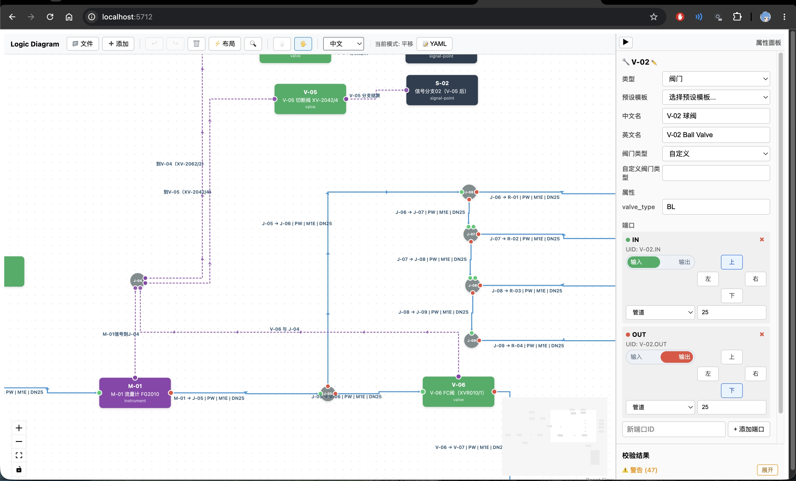
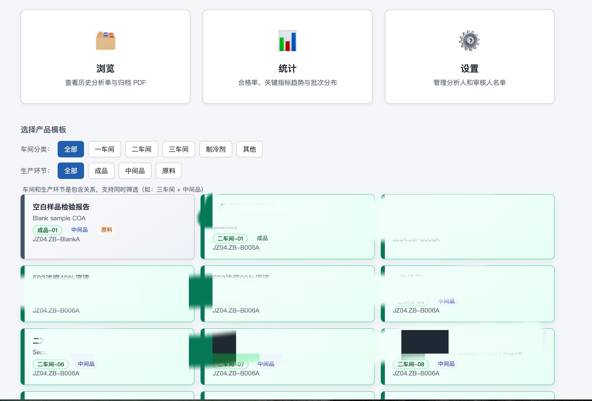
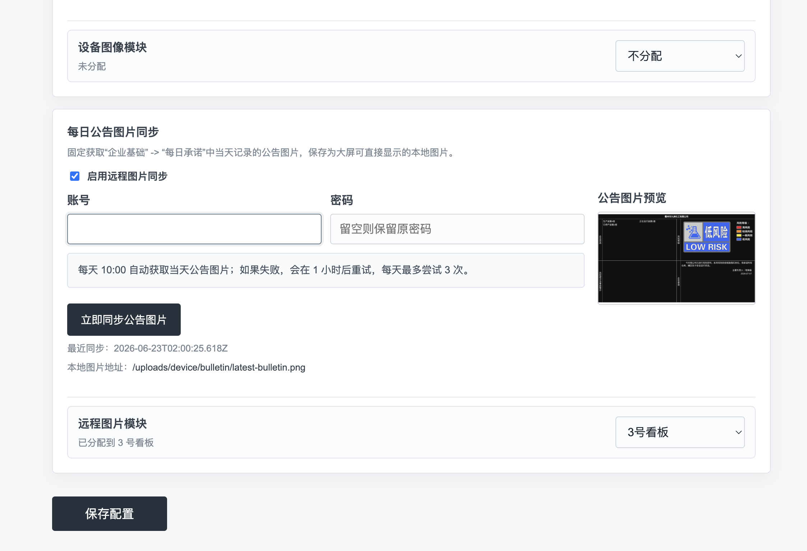

# Utility Tools

这个仓库按分支保存不同的小工具。

## Branches

- `analysis-label-printer`: 化学分析样品标签自动打印工具，包含 Flask 服务、触屏前端、批号管理和部署示例。本项目是部署于 LINUX 并连接一台德冬标签打印机（需要驱动）。
  
- `analysis-workflow-template`: 化学分析流程系统模板。状态：正在开发中。

- `pid-pipe-label-tools`: 一个用于重新绘制传统（化工CAD）图纸的交互式思维导图工具。目的是可以存储、定义节点的具体属性如材质，厚度、管道粗细、介质等。核心亮点：可在节点（设备、仪表、管道、容器）上定义 IO 端口，类似电路设计，如此便可方便版本管理、自动化处理筛选内容，方便工艺现场管理的版本迭代。
  
- `rolling-screen-dashboard`: 滚动屏幕看板工具，主要用于连接应急管理局网站，自动同步企业（自己）每日风险等级的告示，并展现于生产企业的对外 LED 大屏幕。需要将账号密码写入文件。

## 预览

### PID 管道标签工具

### 化学分析流程系统模板

### 滚动屏幕看板工具

默认分支只作为索引页；具体工具代码请切换到对应分支查看。
